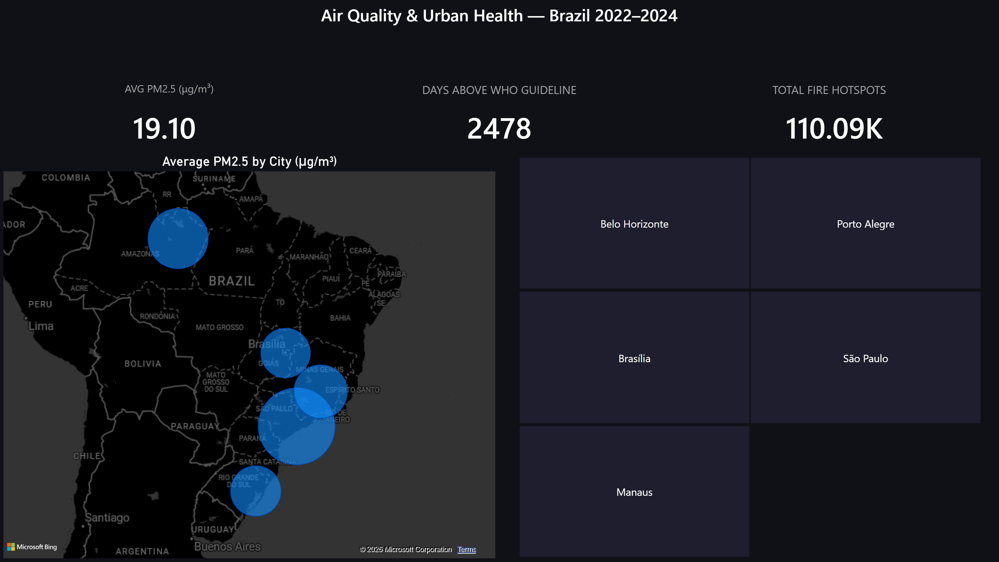
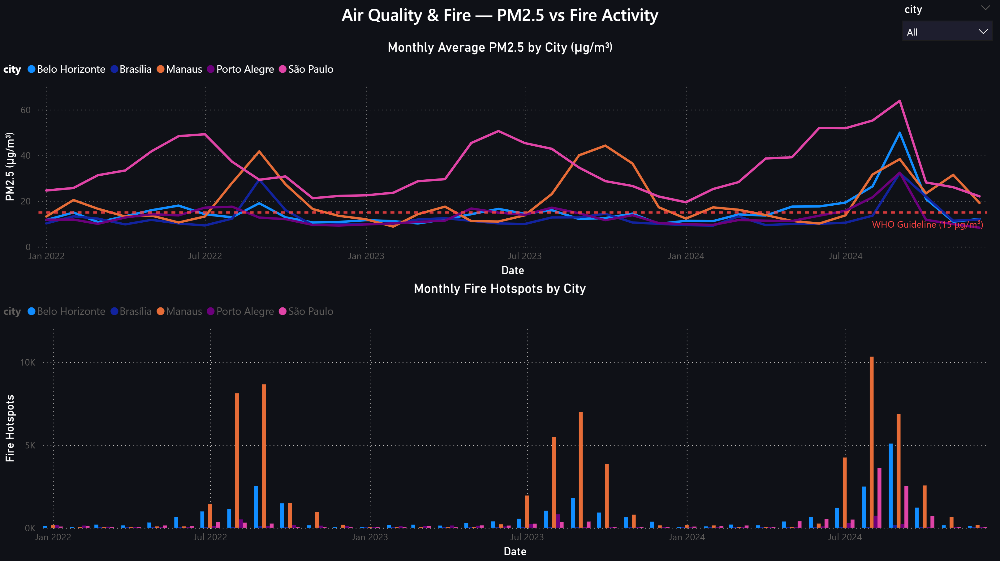
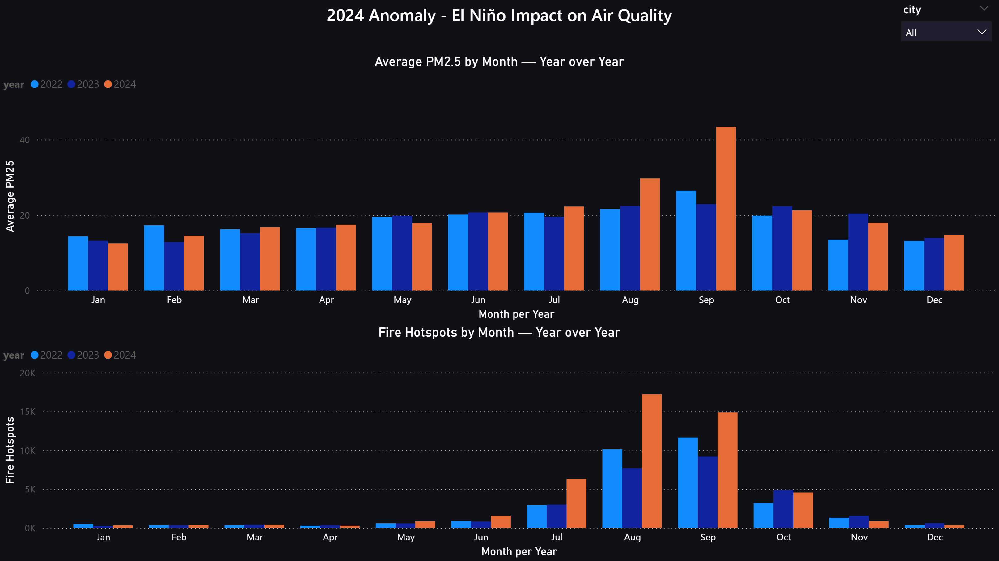
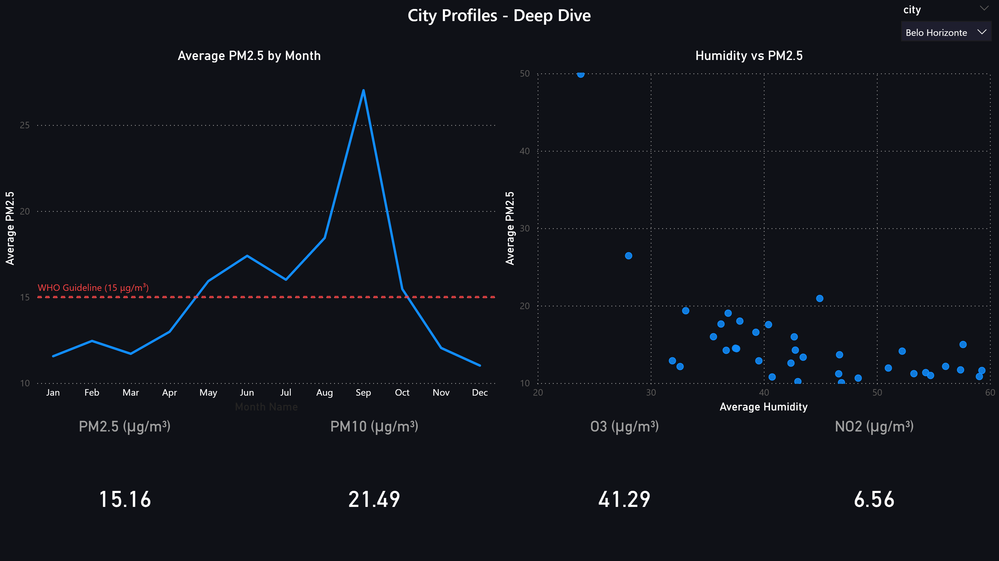

# Air Quality & Urban Health in Brazilian Cities

A full data science portfolio project analyzing the relationship between weather
patterns, fire activity, and air quality across five Brazilian cities from 2022
to 2024. The pipeline covers raw data ingestion, cleaning, exploratory analysis,
machine learning modeling, and an interactive Power BI dashboard.

**Cities:** Belo Horizonte · Brasília · Manaus · Porto Alegre · São Paulo
**Period:** 2022–2024 (weather data extends to 2025)
**Author:** Pedro Abreu — [github.com/pbbabreu](https://github.com/pbbabreu)

---

## 🔍 Quick Summary
**Stack:** Python · pandas · scikit-learn · Power BI · INMET/INPE APIs  
**Scale:** 266,592 rows of weather data · 5 cities · 2022–2025  
**Result:** Random Forest with R²=0.646 · 4-page interactive dashboard  
**Highlight:** 2024 El Niño anomaly detected — São Paulo fire hotspots 5× above historical average

---

## Project structure

```
air_quality_brazil/
├── data/
│   ├── raw/                        # original source files (not tracked by Git)
│   │   ├── INMET/                  # 33 CSV files — hourly weather by station
│   │   ├── hotspots/               # 20 CSV files — fire detections by state/year
│   │   └── SISAM/                  # 5 CSV files — air quality reanalysis by city
│   └── processed/                  # cleaned parquet files (not tracked by Git)
│       ├── inmet_clean.parquet     # 266,592 rows × 25 cols — hourly weather
│       ├── hotspots_clean.parquet  # 3,864 rows × 11 cols — daily city hotspots
│       ├── sisam_clean.parquet     # 5,480 rows × 9 cols — daily air quality
│       └── integrated.parquet      # 5,480 rows × 33 cols — joined dataset
├── models/
├── notebooks/
│   ├── 01_inmet_collection.ipynb
│   ├── 02_inmet_cleaning.ipynb
│   ├── 03_inmet_eda.ipynb
│   ├── 04_hotspots_cleaning.ipynb
│   ├── 05_hotspots_eda.ipynb
│   ├── 06_sisam_cleaning.ipynb
│   ├── 07_sisam_eda.ipynb
│   ├── 08_integration_eda.ipynb
│   └── 09_modeling.ipynb
├── powerbi/
│   ├── main_dashboard.pbix
│   └── screenshots/
│       ├── overview.png
│       ├── air_quality_fire.png
│       ├── anomaly_2024.png
│       └── city_profiles.png
├── SCHEMA.md
├── pyproject.toml
└── README.md
```

---

## Data sources

| Source | Description | Coverage |
|---|---|---|
| [INMET](https://bdmep.inmet.gov.br) | Hourly weather from automatic stations | 2022–2025 |
| [INPE Queimadas](https://queimadas.dgi.inpe.br) | Daily fire hotspots — AQUA M-T satellite | 2022–2025 |
| [SISAM/CPTEC](http://sisam.cptec.inpe.br) | Daily air quality reanalysis — PM2.5, PM10, O3, CO, NO2 | 2022–2024 |

---

## Pipeline

| Step | Notebooks | Status |
|---|---|---|
| Data collection | 01 | ✓ |
| Cleaning & standardization | 02, 04, 06 | ✓ |
| Exploratory data analysis | 03, 05, 07, 08 | ✓ |
| ML modeling | 09 | ✓ |
| Interactive dashboard | powerbi/ | ✓ |

---

## Key findings

### Weather & climate (notebooks 03, 05)

- **Five distinct climate regimes** confirmed across cities — equatorial (Manaus),
  cerrado (Brasília), highland tropical (BH, São Paulo), subtropical (Porto Alegre)
- **2024 El Niño anomaly** produced simultaneous extremes: catastrophic flooding in
  Porto Alegre (May 2024, precipitation Z-score = +4.17) and record drought across
  the southeast and center-west (Brasília average humidity dropped to 32% in Sep 2024)
- **Manaus atmospheric feedback loop confirmed:** dry season heat drives
  evapotranspiration → cloud buildup → radiation suppression → wet season onset.
  Solar radiation and humidity are near-perfectly inverse throughout the dataset
- **Fire season** tightly bounded June–October across all cities; 2024 anomalous
  in both count and intensity — São Paulo jumped from ~1,500 to ~8,700 annual
  hotspots (5× increase)

### Air quality (notebooks 07, 08)

- **Dataset mean PM2.5 (19.10 μg/m³) already exceeds the WHO daily guideline
  (15 μg/m³)** — 2,478 of 5,480 city-days recorded above the threshold
- **Two distinct pollution profiles:** São Paulo shows chronic year-round urban
  pollution above WHO limits; Manaus shows a clean baseline with severe
  fire-season spikes (peak 155.29 μg/m³ — 10× the WHO guideline)
- **2023 was the cleanest year** across all cities and pollutants
- **Wind and fire hotspots have a conditional relationship with PM2.5:** wind
  disperses pollution when fires are absent, but transports smoke when fires
  are active — the direction of the effect reverses depending on fire season
- **Humidity inversely predicts PM2.5** for BH, Brasília, Manaus, and São Paulo,
  but breaks down for Porto Alegre (frontal system dynamics dominate)

### Modeling (notebook 09)

10 models trained across 5 scopes (Logistic Regression + Random Forest each):

| Scope | Algorithm | R² | MAE |
|---|---|---|---|
| All 5 cities | Random Forest | 0.615 | — |
| **4 cities (excl. Porto Alegre)** | **Random Forest** | **0.646** | **5.59 μg/m³** |
| Porto Alegre only | Random Forest | 0.411 | — |
| Manaus only | Random Forest | 0.446 | — |
| Belo Horizonte only | Random Forest | 0.462 | 3.47 μg/m³ |

- Random Forest consistently outperforms Linear Regression (R² gap 0.13–0.18)
- Porto Alegre excluded from the best multi-city model — its frontal rainfall
  dynamics make it a structural outlier that degrades model performance
- **Key features:** `city_São Paulo` dominates multi-city models (~0.39 importance),
  reflecting its chronically elevated baseline; `month` dominates Manaus (0.52),
  reflecting its fire season; `log_hotspots` and nighttime humidity are co-equal
  for BH
- Models underpredict extreme events — reliable for typical days, not worst-case

---

## Dashboard

The Power BI dashboard (`powerbi/main_dashboard.pbix`) covers four pages.

**Page 1 — Overview**
KPI cards (avg PM2.5, days above WHO guideline, total fire hotspots), city map
sized by average PM2.5, and a city slicer that filters the entire page.



**Page 2 — Air Quality & Fire**
Monthly PM2.5 trends by city with WHO guideline reference line, and fire hotspot
bars aligned on the same time axis — showing the fire-to-pollution relationship
directly.



**Page 3 — 2024 Anomaly**
Year-over-year comparison of PM2.5 and fire hotspots across all 12 months,
isolating the El Niño fire season signature in Aug–Sep 2024.



**Page 4 — City Profiles**
Per-city seasonal PM2.5 pattern, humidity vs PM2.5 scatter, and pollutant
breakdown cards (PM2.5, PM10, O3, NO2). Single-select city slicer drives all visuals.



**Note:** The dashboard connects to `data/processed/integrated.parquet` via
Power BI's Parquet connector. To refresh data after cloning, remap the source
path in Power Query to your local file location
(`Transform Data → Data source settings`).

---

## Limitations

- SISAM air quality reanalysis ends at 2024-12-31 — 2025 weather and fire data
  collected but air quality analysis not possible without updated SISAM data
- Porto Alegre's Belém Novo station excluded due to extended offline period in 2025
- 3-year dataset (2022–2024) sufficient for seasonal characterization and anomaly
  detection but insufficient for multi-year trend analysis
- Models underpredict extreme pollution events — the tail of the distribution
  is not well-captured by the current feature set

---

## Setup

```bash
git clone https://github.com/pbbabreu/air-quality-brazil.git
cd air-quality-brazil
uv sync
```

Data files are not tracked by Git due to size. Download instructions and source
URLs are documented in `notebooks/01_inmet_collection.ipynb`. Processed parquet
files can be reproduced by running notebooks 02, 04, and 06 in sequence.

---

## Methodology note

This project intentionally documents the analytical reasoning behind each
decision in notebook markdown cells — including dead ends, data quirks, and
iterative chart improvements. The progression from raw files to final model
is fully reproducible and transparent.
